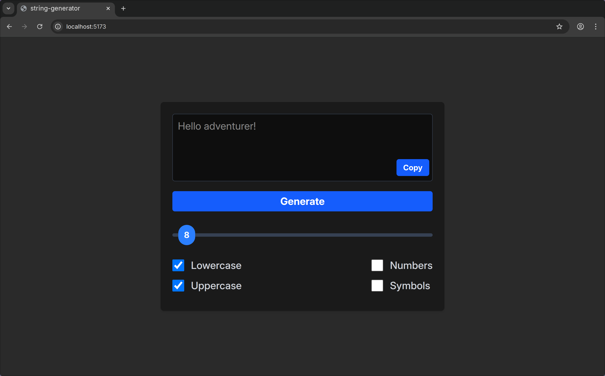

# String-Generator

   

A straightforward utility to generate random strings of a specified length. It's perfect for creating unique identifiers, codes, or any other random string you might need in your JavaScript or Node.js projects.

